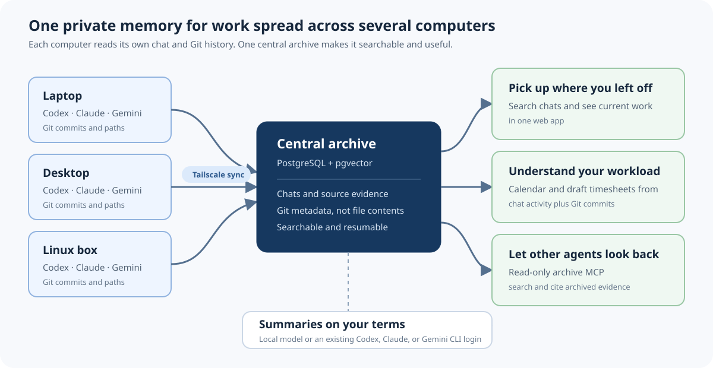

# Open Chat Reviewer

**Pick up where you left off — across every computer.**


[](https://github.com/MiddleDistances/23-open-chat-reviewer/actions/workflows/ci.yml)

## Why I made this

My AI-assisted work was scattered across Codex, Claude, and Gemini chats on several
computers. I wanted one place that could remember what I had been working on, help me
pick up where I left off, and remind me what I was supposed to do next.

Once the chats were together, I realised they could be combined with Git activity to
make a useful workload calendar and draft timesheets. That was unexpectedly handy.

Then I wanted other agents to be able to search the same history: find an old discussion,
recover documentation or references I knew I had seen, or review work that happened on
another machine. The included read-only MCP provides that recall without arbitrary SQL.

Finally, I wanted summaries without forcing everyone to buy another API subscription.
Open Chat Reviewer can use a local model or the Codex, Claude, or Gemini CLI login already
active on the computer.

That is the project: **a private, self-hosted memory for AI-assisted work.**

## What it helps with

### Remember the work

Bring Codex, Claude, and Gemini conversation history from all your computers into one
searchable archive. Open a conversation, inspect its evidence, and see where the work
appears to have stopped.

### Understand your time

Combine chat activity with Git commit metadata to create a workload calendar and draft
timesheets. Overlapping activity is merged so parallel agents are not blindly counted as
extra human hours.

### Summarise on your terms

Use a local model, or reuse an existing Codex, Claude, or Gemini CLI login. The application
sends one bounded evidence packet to the selected summariser; it does not copy CLI tokens.

### Let agents look back

The public MCP lets another agent search and cite this archive without giving
it arbitrary SQL, filesystem access, or permission to rewrite the evidence.

## How it works



Each computer reads its own chat and Git sources without modifying them. A small sync
helper sends that evidence over a private Tailscale network to one PostgreSQL archive. The web
app and derived jobs run on the central computer.

You can also run everything on one computer without Tailscale. Add Tailscale only when
you want to connect another machine.

## Try it on one computer

You need Python 3.12 or 3.13, [uv](https://docs.astral.sh/uv/), and Docker with Compose.
[Bun](https://bun.sh/) is needed to build the web interface.

```bash
git clone https://github.com/MiddleDistances/23-open-chat-reviewer.git
cd 23-open-chat-reviewer
scripts/install.sh
```

Open the URL printed by `bootstrap.sh`. By default, Open Chat Reviewer looks for:

- Codex in `~/.codex`
- Claude in `~/.claude`
- Gemini in `~/.gemini`
- Git repositories under `~/Projects`

The Setup page lets you choose the history range, providers, reasoning policy, and local
embedding model before starting a larger build.

## Add another computer

1. Install Tailscale and sign in on both computers.
2. On the central computer, open **Setup → Add another machine**. Setup shows the exact
   command that creates a private connection file.
3. Transfer that file privately, then run the install command shown by Setup on
   the new computer:

```bash
git clone https://github.com/MiddleDistances/23-open-chat-reviewer.git && cd 23-open-chat-reviewer && scripts/connect-computer.sh ~/Downloads/my-computer.env
```

The installer checks the connection, previews local sources, performs the first resumable
sync, and installs the recurring sync schedule. The full beginner and security guide is
[Connect several computers with Tailscale](docs/TAILSCALE_MULTI_MACHINE.md).

## What is available today

- Cross-machine Codex, Claude, Gemini, and Git ingestion
- Exact search, conversation traces, evidence links, and annotations
- Optional local semantic search and corpus map
- Workload calendar and draft timesheet export
- Local Qwen summaries or existing coding-agent CLI subscriptions
- Guided multi-computer setup over Tailscale
- Resumable sync with source hashes and machine attribution
- Read-only MCP for agent recall
- Safe backup, restore, update, and service removal scripts

Still in progress:

- Packaged installers that remove the Git/Python setup for non-technical users
- Further semantic-map lifecycle and performance tuning for very large archives

## What is stored

Open Chat Reviewer stores configured chat records and their provenance, normalized
conversation events, and rebuildable views such as semantic vectors and workload
snapshots. Git ingestion stores repository and commit metadata, changed filenames, and
status — **not Git blobs, patches, or complete file contents**.

Source directories are read-only. Runtime configuration, logs, and credentials stay in
the Git-ignored `.chatreview/` directory. Read [Setup, scope, and storage](docs/SETUP_AND_STORAGE.md)
for the exact retention and reasoning choices.

## Privacy and security

Chat archives can contain private code, prompts, paths, and credentials. Open Chat
Reviewer has no built-in public-user authentication. Keep it on loopback or a restricted
Tailscale network; do not expose the web or PostgreSQL ports to the public internet.

Embedding models can be downloaded from Hugging Face and then run locally. Summary CLI
providers reuse the login already managed by their own CLI and do not give Open Chat
Reviewer the underlying token.

Read [SECURITY.md](SECURITY.md) before connecting several machines.

## Useful commands

```bash
uv run open-chat-reviewer doctor
uv run open-chat-reviewer status
uv run open-chat-reviewer search "database migration"
uv run open-chat-reviewer timesheets export --format csv
```

## Detailed documentation

- [Setup, scope, and storage](docs/SETUP_AND_STORAGE.md)
- [Connect several computers with Tailscale](docs/TAILSCALE_MULTI_MACHINE.md)
- [Architecture](docs/ARCHITECTURE.md)
- [Sync and recovery](docs/SYNC_OPERATIONS.md)
- [Summary model providers](docs/MODEL_PROVIDERS.md)
- [Read-only MCP](docs/MCP.md)
- [Backup and maintenance](docs/MAINTENANCE.md)
- [Source adapters](docs/SOURCE_ADAPTERS.md)
- [Deployment](docs/DEPLOYMENT.md)

## Development

```bash
uv sync
uv run ruff check src tests
uv run pytest -q
cd web && bun install --frozen-lockfile && bun run test && bun run build
```

The project is alpha software. Contributions and plain-language setup feedback are very
welcome. Start with the [contribution guide](CONTRIBUTING.md), browse
[`good first issue`](https://github.com/MiddleDistances/23-open-chat-reviewer/labels/good%20first%20issue),
or ask a question in [Discussions](https://github.com/MiddleDistances/23-open-chat-reviewer/discussions).
Project decision-making is documented in [GOVERNANCE.md](GOVERNANCE.md), and support
routes are listed in [SUPPORT.md](SUPPORT.md).

## License

Apache License 2.0. See [LICENSE](LICENSE).
